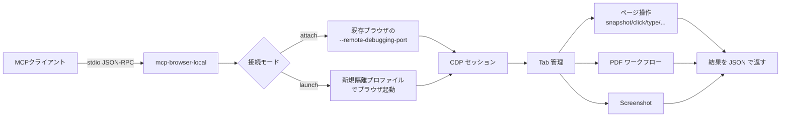

<div align="center">

# mcp-browser-local

### Codex / Claude Code 向けのローカル Chromium MCP サーバー

[](#インストール)
[](#インストール)
[](#特徴)
[](#特徴)
[](LICENSE)

**ヘッドレスではなくデスクトップで普段使いしている `Brave` / `Chrome` / `Edge` / `Chromium` を、AIエージェントから安全に操作するための MCP サーバー。**

---

</div>

## 概要

`mcp-browser-local` は **Codex** や **Claude Code** などの MCP クライアントから、ローカルで動いている Chromium 系ブラウザを操作するための stdio ベースの MCP サーバーです。

ヘッドレス自動化用途ではなく、**実際にユーザーが使っているデスクトップブラウザ**に対して動作することを前提に設計されています。

- 既に起動している `Brave` / `Chrome` / `Edge` / `Chromium` に **アタッチ**（`--remote-debugging-port` 必要）
- もしくは **隔離プロファイル / 明示プロファイルパス**で新しいセッションを起動
- 完全な HTML ダンプではなく **軽量なセマンティックスナップショット**でページを読み取り
- ページ自動操作: タブ / ナビゲーション / クリック / 入力 / キー押下 / スクロール / スコープ付き text・HTML 取得 / スクリーンショット
- ローカル / URL / カレントタブの **PDF テキスト抽出**
- PDF ビューアの操作 (open, viewer state, next/prev page)
- MCP が開いたタブの **追跡 + 自動クリーンアップ**（disconnect 時）

## 特徴

| カテゴリ | 内容 |
|---|---|
| 接続モード | アタッチ (既存ブラウザに `--remote-debugging-port` 経由) / 起動 (隔離プロファイル or 明示パス) |
| 対応ブラウザ | Brave, Chrome, Edge, Chromium (Windows / 他 OS は CDP 経由で動作可) |
| ページ読み取り | `browser_snapshot` (セマンティック要約 + 短命 `elementRef`), `browser_get_text`, `browser_get_html` (スコープ可) |
| ページ操作 | click / type / press_key / scroll / wait_for / 各種 navigation |
| スクリーンショット | PNG, 明示出力先 or デフォルト `~/.mcp-browser-local/screenshots/` |
| PDF | open → viewer_state → next/prev → extract のワークフロー、ローカルファイル / URL / カレントタブ対応 |
| Cookie / Storage | get/set cookies, get/set localStorage / sessionStorage |
| セッション管理 | 同時複数セッション、`browser_list_sessions`, `browser_get_session` |
| 管理タブ | MCP が開いたタブのメモ付け (`browser_note_tab`) と自動クリーンアップ |
| 安全弁 | デフォルトで `browser_eval` と file upload を**無効化**、環境変数で許可制 |

提供ツール数: **36 個** (`browser_*`)

## 安全モデル

| 設定 | デフォルト | 環境変数 |
|---|---|---|
| Attach 許可 | 有効 | `MCP_BROWSER_ALLOW_ATTACH` |
| Launch 許可 | 有効 | `MCP_BROWSER_ALLOW_LAUNCH` |
| `browser_eval` (任意 JS 実行) | **無効** | `MCP_BROWSER_ALLOW_EVAL=1` |
| ファイルアップロード | **無効** | `MCP_BROWSER_ALLOW_FILE_UPLOAD=1` |
| 許可アップロードルート | なし | `MCP_BROWSER_ALLOWED_UPLOAD_ROOTS` |

`browser_eval` は任意の JavaScript を実行できるためデフォルトで無効。明示的に許可するまで実行できません。
`launch + browser-default profile` (ユーザーの普段使いプロファイルを丸ごと起動) は意図的にサポートしていません — 隔離プロファイル or 明示パスのみ。

## 処理フロー



## インストール

```bash
git clone https://github.com/cUDGk/mcp-browser-local.git
cd mcp-browser-local
npm install
npm run build
```

Node.js 20 以上が必要です。

## 使い方

### 起動

```bash
node dist/index.js
```

stdio で JSON-RPC を待ち受けます。MCP クライアントから接続してください。

### 開発

```bash
npm run dev        # tsx で直接実行
npm run typecheck  # 型チェックのみ
```

### Codex / Claude Code への登録

```json
{
  "mcpServers": {
    "browser-local": {
      "command": "node",
      "args": ["C:\\Users\\<you>\\mcp-browser-local\\dist\\index.js"]
    }
  }
}
```

### ブラウザを attach 用に起動する

#### Brave

```powershell
"C:\Program Files\BraveSoftware\Brave-Browser\Application\brave.exe" --remote-debugging-port=9222
```

#### Chrome

```powershell
"C:\Program Files\Google\Chrome\Application\chrome.exe" --remote-debugging-port=9222
```

起動後、MCP から `browser_list_running` で `attachable: true` のプロセスを確認し、`browser_connect` でアタッチします。

## 環境変数

| 変数 | 用途 |
|---|---|
| `MCP_BROWSER_LOG_LEVEL` | ログレベル (`debug` / `info` / `warn` / `error`) |
| `MCP_BROWSER_ALLOW_ATTACH` | attach モード許可 |
| `MCP_BROWSER_ALLOW_LAUNCH` | launch モード許可 |
| `MCP_BROWSER_ALLOW_EVAL` | `browser_eval` を有効化 |
| `MCP_BROWSER_ALLOW_FILE_UPLOAD` | ファイルアップロード有効化 |
| `MCP_BROWSER_ALLOWED_UPLOAD_ROOTS` | アップロード許可ディレクトリ (`;` 区切り) |
| `MCP_BROWSER_DOWNLOAD_DIR` | ダウンロード保存先 |
| `MCP_BROWSER_SCREENSHOT_DIR` | スクリーンショット保存先 (既定: `~/.mcp-browser-local/screenshots`) |
| `MCP_BROWSER_TEMP_DIR` | 一時ファイル保存先 |

## 主要ツール一覧 (36 個)

| カテゴリ | ツール |
|---|---|
| 検出 | `browser_list_installations`, `browser_list_running` |
| セッション | `browser_connect`, `browser_launch`, `browser_disconnect`, `browser_list_sessions`, `browser_get_session` |
| タブ管理 | `browser_list_tabs`, `browser_new_tab`, `browser_activate_tab`, `browser_close_tab`, `browser_list_managed_tabs`, `browser_note_tab` |
| ナビゲーション | `browser_navigate`, `browser_go_back`, `browser_go_forward`, `browser_reload`, `browser_wait_for` |
| ページ読み取り | `browser_snapshot`, `browser_get_text`, `browser_get_html`, `browser_eval` |
| 入力 | `browser_click`, `browser_type`, `browser_press_key`, `browser_scroll` |
| 撮影 | `browser_take_screenshot` |
| PDF | `browser_pdf_open`, `browser_pdf_viewer_state`, `browser_pdf_next_page`, `browser_pdf_prev_page`, `browser_pdf_extract` |
| Cookie / Storage | `browser_get_cookies`, `browser_set_cookies`, `browser_storage_get`, `browser_storage_set` |

## メモ

- アタッチモードでは、ダウンロード保存先は既存ブラウザの設定に従います (MCP は介入しない)
- `browser_snapshot` は最初の読み取りツールとして設計されています。セマンティック構造と短命の `elementRef` を返します
- `elementRef` は同一ドキュメント内で有効。ナビゲーションや大規模再描画後は無効になる場合があります
- 推奨 PDF ワークフロー: `browser_pdf_open` → `browser_pdf_viewer_state` → `browser_pdf_next_page` / `browser_pdf_prev_page` → `browser_pdf_extract`
- `browser_pdf_open` はデフォルトでカレントタブを再利用します。`newTab: true` を渡せば新しいタブで開きます
- MCP が開いたタブは追跡され、`browser_disconnect` で自動的に閉じられます
- `browser_list_managed_tabs` と `browser_note_tab` で MCP が触ったタブを確認・注釈できます

## 動作確認 (実測値)

| 操作 | 応答時間 |
|---|---|
| `initialize` | ~5 ms |
| `browser_list_installations` | ~410 ms |
| `browser_list_running` | ~395 ms |
| `browser_launch` (隔離 Brave) | ~910 ms |
| `browser_new_tab` | ~45 ms |
| `browser_snapshot` | ~40 ms |
| `browser_get_text` | ~25 ms |
| `browser_take_screenshot` | ~110 ms |
| `browser_disconnect` | ~25 ms |

(Windows 11 / Brave / Node.js 22 環境での実測値)

## 変更履歴

### 0.1.1

- Claude Code などの LLM クライアントが object / array 型の引数を JSON 文字列として送ってくる挙動に対応。`target` / `windowSize` / `cookies` / `entries` / `pages` などを文字列で受け取っても zod reject せずに自動で JSON パースしてから検証する
- 対象ツール: `browser_launch` (windowSize)、`browser_get_text` / `browser_get_html` / `browser_click` / `browser_type` (target)、`browser_set_cookies` (cookies)、`browser_storage_set` (entries)、`browser_pdf_extract` (pages)

## ライセンス

MIT License — Copyright (c) 2026 cUDGk
詳細は [LICENSE](LICENSE) を参照。

英語版 README は [README_en.md](README_en.md) を参照してください。
